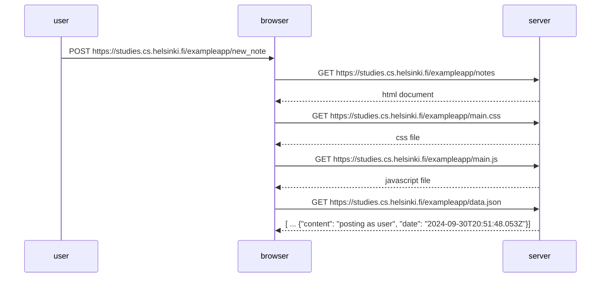

```mermaid
sequenceDiagram
    participant user
    participant browser
    participant server
        user->>browser: POST https://studies.cs.helsinki.fi/exampleapp/new_note
        browser->>server: GET https://studies.cs.helsinki.fi/exampleapp/notes
        server-->>browser: html document
        browser->>server: GET https://studies.cs.helsinki.fi/exampleapp/main.css
        server-->>browser: css file
        browser->>server: GET https://studies.cs.helsinki.fi/exampleapp/main.js
        server-->>browser: javascript file
        browser->>server: GET https://studies.cs.helsinki.fi/exampleapp/data.json
        server-->>browser: [ ... {"content": "posting as user", "date": "2024-09-30T20:51:48.053Z"}]


```
