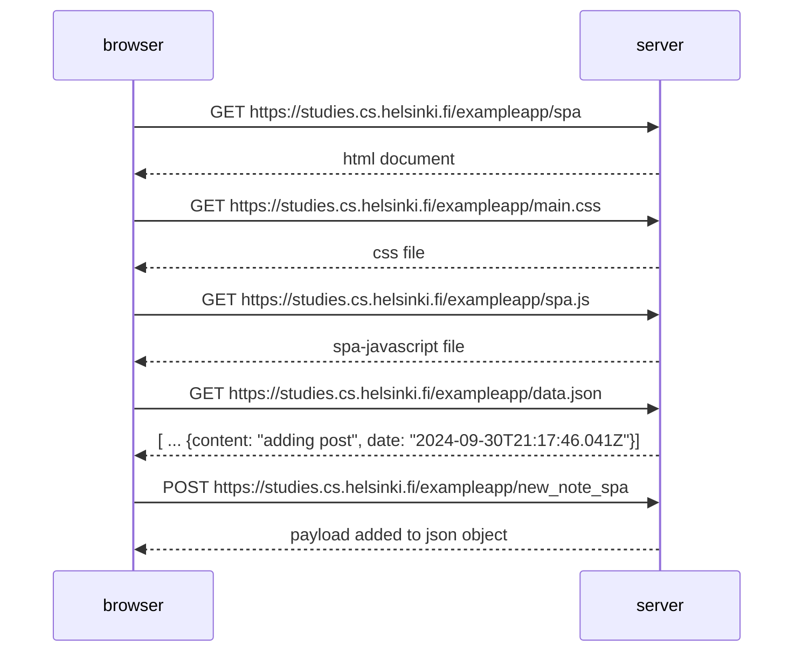

```mermaid
    sequenceDiagram
        participant browser
        participant server
        
        browser->>server: GET https://studies.cs.helsinki.fi/exampleapp/spa
        server-->>browser: html document
        browser->>server: GET https://studies.cs.helsinki.fi/exampleapp/main.css
        server-->>browser: css file
        browser->>server: GET https://studies.cs.helsinki.fi/exampleapp/spa.js
        server-->>browser: spa-javascript file
        browser->>server: GET https://studies.cs.helsinki.fi/exampleapp/data.json
        server-->>browser: [ ... {content: "adding post", date: "2024-09-30T21:17:46.041Z"}]
        browser->>server: POST https://studies.cs.helsinki.fi/exampleapp/new_note_spa
        server-->>browser: payload added to json object

```
